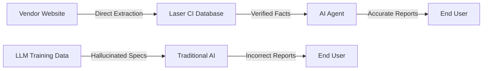
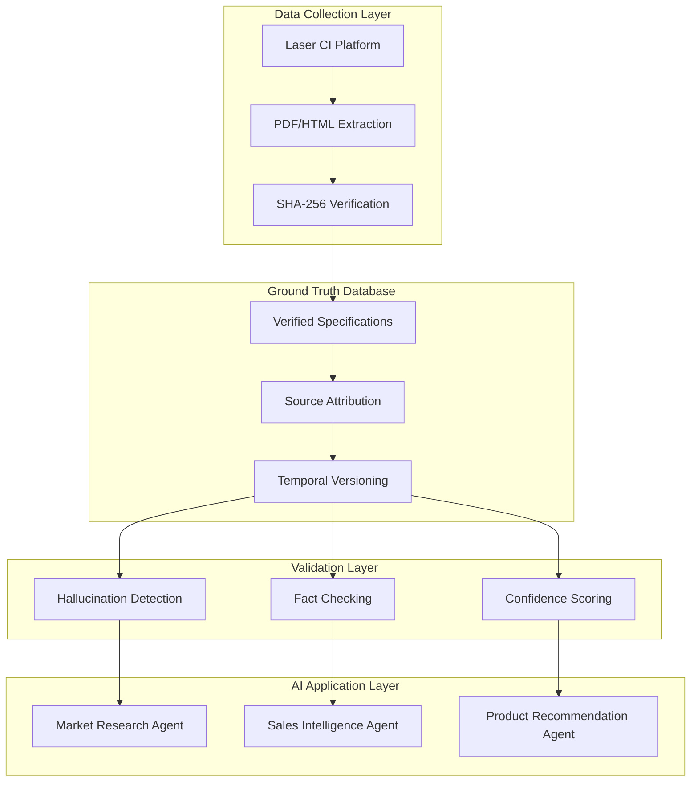

# Laser CI as Ground Truth for AI Systems

## The Hallucination Problem

Even the most advanced LLMs (GPT-4, Claude, Gemini) consistently hallucinate technical specifications:
- **Fabricate model numbers** that don't exist
- **Invent specifications** that sound plausible but are wrong
- **Mix specifications** from different products
- **Use outdated information** from training data
- **Generate confident but false** technical details

## Why LLMs Hallucinate Product Specs

### 1. Training Data Limitations
- LLMs trained on data from various time periods
- Specifications change but training data doesn't update
- Mix of marketing material, research papers, and forums creates confusion

### 2. Pattern Matching Without Verification
- LLMs generate "plausible-sounding" specifications
- Example: "The OBIS 488nm laser has 150mW output" (sounds right, but might be 100mW or 200mW)
- No ability to verify against actual datasheets

### 3. Composite Memory Problem  
- LLMs blend information from multiple sources
- Coherent OBIS specs mixed with Cobolt specs
- Creates technically plausible but factually wrong combinations

## The Solution: Verified Ground Truth

### What Makes Laser CI Different



### Our Ground Truth Architecture

#### 1. **Source Verification**
Every specification traced to source:
```json
{
  "product": "OBIS LX 488nm",
  "wavelength_nm": 488,
  "output_power_mw": 100,
  "source": {
    "url": "https://coherent.com/obis-datasheet.pdf",
    "page": 3,
    "extracted_date": "2024-03-15",
    "content_hash": "sha256:a7b9c2d4e5f6..."
  }
}
```

#### 2. **Temporal Accuracy**
Specifications timestamped and versioned:
- Know exactly when spec was valid
- Track changes over time
- Provide historical accuracy

#### 3. **No Interpretation Layer**
Direct extraction means no hallucination:
- PDF says "100mW" → Database stores 100
- No LLM "reasoning" about what it "should" be
- Pure factual extraction

## Integration with AI Market Research Apps

### API-Based Ground Truth

```python
class GroundTruthAPI:
    def get_product_specs(self, product_name: str) -> dict:
        """
        Returns verified specifications from ground truth database.
        Never returns hallucinated or interpolated values.
        """
        spec = self.database.query_exact(product_name)
        if not spec:
            return {"error": "Product not in database", "hallucination_risk": "high"}
        
        return {
            "specs": spec,
            "source": spec.source_url,
            "verification_date": spec.extracted_date,
            "confidence": "ground_truth"
        }
    
    def validate_ai_output(self, ai_generated_spec: dict) -> dict:
        """
        Validates AI-generated specifications against ground truth.
        """
        truth = self.get_product_specs(ai_generated_spec['product'])
        
        discrepancies = []
        for field, ai_value in ai_generated_spec.items():
            if field in truth['specs']:
                if ai_value != truth['specs'][field]:
                    discrepancies.append({
                        "field": field,
                        "ai_claimed": ai_value,
                        "actual": truth['specs'][field],
                        "error_type": "hallucination"
                    })
        
        return {"valid": len(discrepancies) == 0, "errors": discrepancies}
```

### RAG (Retrieval-Augmented Generation) Integration

```python
class LaserCIRAGSystem:
    def generate_market_report(self, query: str) -> str:
        """
        Generate reports using ONLY verified ground truth data.
        """
        # Step 1: Retrieve relevant products from ground truth
        products = self.ground_truth.search(query)
        
        # Step 2: Build context with ONLY verified specs
        context = self.build_factual_context(products)
        
        # Step 3: Generate report with facts, not hallucinations
        prompt = f"""
        Generate a market report using ONLY these verified specifications.
        Do not add any specifications not provided.
        Do not estimate or interpolate values.
        
        Verified Data:
        {context}
        
        Query: {query}
        """
        
        return self.llm.generate(prompt, temperature=0)  # Zero temperature for factual
```

## Use Cases for AI Ground Truth

### 1. Market Research Reports
- **Without Ground Truth**: "The 488nm laser market includes products ranging from 50-500mW"
- **With Ground Truth**: "Based on verified data: Coherent OBIS 488nm (100mW), Cobolt 488nm (150mW), Oxxius LBX-488 (200mW)"

### 2. Competitive Analysis
- **Without Ground Truth**: AI invents plausible competitor specs
- **With Ground Truth**: Exact specifications with source citations

### 3. Product Recommendations
- **Without Ground Truth**: Recommends products that don't exist
- **With Ground Truth**: Only recommends verified, available products

### 4. Technical Documentation
- **Without Ground Truth**: Mixes specifications from different products
- **With Ground Truth**: Accurate specs for exact model referenced

## Preventing Common Hallucinations

### Hallucination Type 1: Specification Interpolation
**LLM Behavior**: "Since the 473nm is 100mW and 532nm is 200mW, the 488nm must be 150mW"
**Ground Truth**: "OBIS 488nm is actually 100mW per datasheet"

### Hallucination Type 2: Feature Attribution
**LLM Behavior**: "All OBIS lasers have TTL modulation"
**Ground Truth**: "OBIS LX has TTL, OBIS LS does not"

### Hallucination Type 3: Vendor Confusion
**LLM Behavior**: "Coherent's Cobolt series..." (Cobolt is Hübner)
**Ground Truth**: Correct vendor attribution for every product

### Hallucination Type 4: Temporal Confusion
**LLM Behavior**: Mixes 2020 specs with 2024 specs
**Ground Truth**: Timestamped specifications with version history

## Implementation Best Practices

### 1. Always Query Ground Truth First
```python
def get_product_info(product_name: str):
    # FIRST: Check ground truth
    ground_truth = laser_ci.get_specs(product_name)
    
    if ground_truth.exists():
        return ground_truth.data  # Never hallucinate
    
    # ONLY if not in database, warn about hallucination risk
    return {
        "warning": "No ground truth available",
        "hallucination_risk": "high",
        "suggestion": "Add product to Laser CI monitoring"
    }
```

### 2. Validate AI Outputs
```python
def validate_ai_report(report: str):
    # Extract all specifications mentioned
    specs_mentioned = extract_specs(report)
    
    # Validate each against ground truth
    for spec in specs_mentioned:
        truth = laser_ci.validate(spec)
        if not truth.valid:
            flag_hallucination(spec, truth.correct_value)
```

### 3. Confidence Scoring
```python
def confidence_score(source: str) -> float:
    if source == "laser_ci_ground_truth":
        return 1.0  # 100% confidence
    elif source == "llm_with_rag":
        return 0.7  # 70% confidence
    else:  # pure LLM
        return 0.3  # 30% confidence for specs
```

## Benefits for AI Applications

### 1. **Liability Reduction**
- Incorrect specs in reports = potential legal issues
- Ground truth = defensible data source
- Full audit trail to original documents

### 2. **Customer Trust**
- Customers discover hallucinations = lost credibility
- Verified specs = maintained trust
- Source citations = transparency

### 3. **Competitive Advantage**
- Competitors using LLMs hallucinate
- You provide verified facts
- Accuracy becomes your differentiator

### 4. **Scalability**
- Add new products to ground truth once
- All AI agents benefit immediately
- No retraining required

## Integration Architecture



## ROI of Ground Truth System

### Cost of Hallucinations
- **Customer complaint about wrong spec**: $10,000 (reputation damage)
- **Lost sale due to incorrect comparison**: $50,000
- **Legal issue from false claims**: $100,000+

### Value of Ground Truth  
- **Zero hallucination rate**: Priceless
- **Customer trust maintained**: Increased retention
- **Competitive differentiation**: Premium pricing justified

## Summary

The Laser CI Platform transforms from a competitive intelligence tool into critical infrastructure for AI applications. By providing verified, timestamped, source-attributed specifications, it enables AI systems to generate accurate market research without hallucinations.

**This isn't just about better data - it's about enabling AI applications that are actually trustworthy in technical domains where accuracy matters.**

### Key Takeaway

> "LLMs are excellent at analysis and terrible at facts. Laser CI provides the facts so LLMs can focus on analysis."

With Laser CI as your ground truth system:
- Your AI never claims a 473nm laser has 300mW when it actually has 100mW
- Your reports cite actual products, not imaginary ones
- Your competitive analysis is based on reality, not plausible fiction

**In technical markets, the difference between mostly correct and actually correct is everything.**